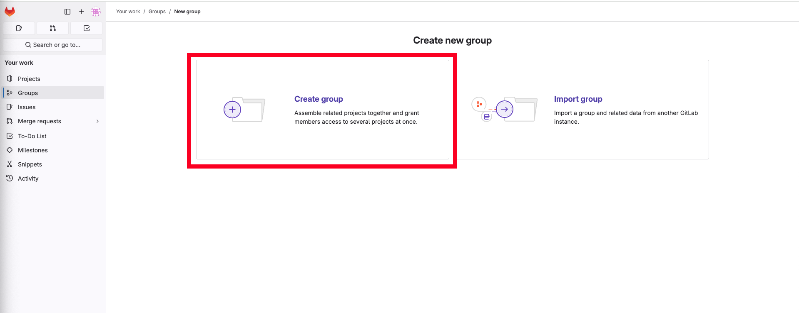
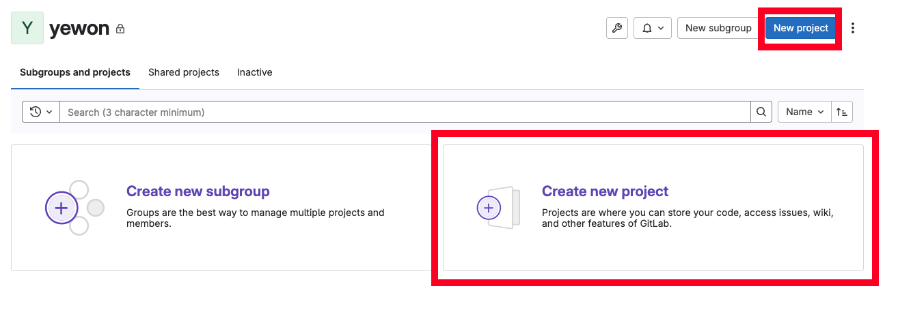
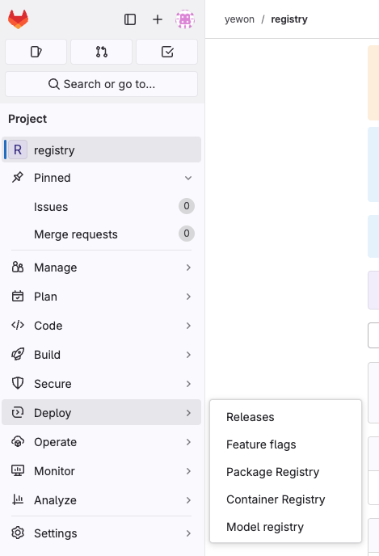
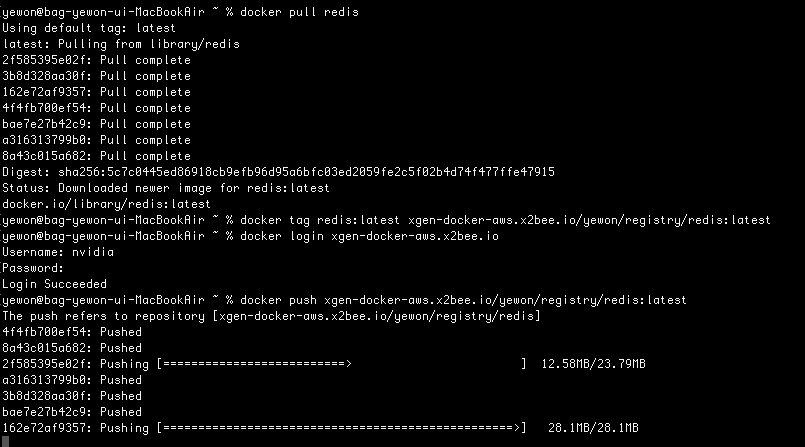

# GitLab에 Docker Registry 서버 만들기

사내 또는 고객사 환경에서 Docker Registry가 필요할 때 AWS ECR이나 ACR 같은 **퍼블릭 Registry**를 사용하지 못하는 경우가 있습니다.

이번 글에서는 **GitLab**에 내장된 **Registry 기능**을 활성화하여 자체 Docker Registry를 구성하는 방법을 정리했습니다.

핵심 목표는 이미 만들어진 Docker 이미지를 외부 고객사에게 제공하기 위한 Registry 서버 구축입니다.

---

## 1\. 구성 개요

### 1-1. 사용 환경

-   GitLab 이미지: `gitlab/gitlab-ce:18.4.3-ce.0`
-   Docker Compose 기반 설치
-   GitLab + Registry 동일 컨테이너에서 운영
-   HTTPS 적용 가능 (선택)
-   외부 Nginx Proxy 적용 가능 (선택)

### 1-2. 목적

-   GitLab의 소스 관리 기능 뿐만 아니라 **Docker Registry 기능도 사용**
-   이미지 제공용 Private Registry 구축

### 1-3. 대안 및 선택 이유

일반적으로 아래와 같은 솔루션들을 검토할 수 있습니다.

-   AWS ECR
-   Azure ACR
-   Docker Registry
-   Nexus Repository Docker Hosted

하지만 폐쇄망 또는 고객사 요구사항이 있을 때는, **GitLab Registry가 가장 단순하고 빠르게 구축**할 수 있는 점에서 유리합니다.

---

## 2\. GitLab CE 설치 (Docker Compose)

### 2-1. `.env` 파일

```bash
IMGAGE=gitlab/gitlab-ce
TAG=18.4.3-ce.0

PORT=8084
CONTAINER_NAME=gitlab

GITLAB_HOSTNAME=gitlab.example.com
GITLAB_EXTERNAL_URL=http://gitlab.example.com
GITLAB_REGISTRY_URL=docker.example.com
GITLAB_REGISTRY_PORT=5000

GITLAB_HTTP_PORT=8080
GITLAB_SSH_PORT=8022

SHM_SIZE=512m
```

### 2-2. docker-compose.yml 파일

```yaml
services:
  gitlab:
    image: ${IMGAGE}:${TAG}
    container_name: ${CONTAINER_NAME}
    restart: always
    hostname: ${GITLAB_HOSTNAME}
    ports:
      - ${GITLAB_HTTP_PORT}:80
      # - 443:443  # 필요 시 활성화 (내장 nginx로 인증서 적용 시)
      - ${GITLAB_SSH_PORT}:22
      - ${GITLAB_REGISTRY_PORT}:${GITLAB_REGISTRY_PORT}
    volumes:
      - ./gitlab/config:/etc/gitlab
      - ./gitlab/logs:/var/log/gitlab
      - ./gitlab/data:/var/opt/gitlab
    shm_size: ${SHM_SIZE}
```

## 3\. GitLab Registry 활성화

### 3-1. gitlab.rb 수정

`/etc/gitlab/gitlab.rb` 파일을 편집하여 Registry 설정을 추가합니다.

```ruby
registry_external_url 'https://docker.example.com'
gitlab_rails['registry_enabled'] = true
gitlab_rails['registry_host'] = "docker.example.com"
gitlab_rails['registry_port'] = "5000"
gitlab_rails['registry_path'] = "/var/opt/gitlab/gitlab-rails/shared/registry"
gitlab_rails['registry_api_url'] = "https://docker.example.com"
gitlab_rails['registry_issuer'] = "docker.example.com"

registry['enable'] = true
registry['registry_http_addr'] = "0.0.0.0:5000"

registry_nginx['enable'] = false
```

### 3-2. GitLab 설정 반영

설정값 변경 후 GitLab을 재설정하여 반영합니다.

```bash
docker exec -it gitlab gitlab-ctl reconfigure
```

---

## 4\. Registry 도메인 및 사용법

### 4-1. 도메인 구성

GitLab UI와 Registry는 서로 다른 도메인을 사용해도 문제 없습니다.

| 항목 | 도메인 |
| --- | --- |
| GitLab UI | `gitlab.example.com` |
| Docker Registry | `docker.example.com:5000` |

### 4-2. Registry 이미지 경로 형식

GitLab의 Private Registry에 저장되는 Docker 이미지는 아래 형식을 따릅니다.

```text
https://docker.example.com/group/project/image_name:tag
```

### 4-3. 사용 방법

#### Step 1: Group 생성 (최초 1회)

GitLab UI에서 로그인 후, **Create Group**으로 그룹을 생성합니다.



#### Step 2: Registry Project 생성

Docker 이미지가 저장될 프로젝트를 생성합니다.



#### Step 3: Registry 활성화 확인

사이드바에서 **Deploy → Container Registry**를 선택하여 Registry가 정상 활성화되었는지 확인합니다.



위 화면이 보인다면 Registry 설정이 정상적으로 활성화된 상태입니다.

#### Step 4: Docker 이미지 Push

로컬 환경에서 Docker 이미지를 Registry에 Push합니다.

```bash
# 로그인
docker login docker.example.com:5000

# 이미지 태깅
docker tag myapp:latest docker.example.com:5000/project/myapp:latest

# 이미지 Push
docker push docker.example.com:5000/project/myapp:latest
```



6\. (옵션) HTTPS 사용을 권장합니다.

  
HTTP-only 환경이라면 Docker 설정에 insecure registry 추가 필요:

```
nano /etc/docker/daemon.json
```

-    아래 내용 기입

```
{
"insecure-registries": ["xgen-docker.example.com:5000"]
}
```

#### 7\. (옵션) Nginx Reverse Proxy 구성

```
server {
listen 443 ssl;
server_name docker.example.com;

ssl_certificate /etc/ssl/certs/fullchain.pem;
ssl_certificate_key /etc/ssl/private/privkey.pem;

location /v2/ {
    proxy_pass http://127.0.0.1:5000/v2/;
    proxy_set_header Host $http_host;
    proxy_set_header X-Real-IP $remote_addr;
  }
}
```

####   
8\. 문제 해결 포인트

✔ Registry 로그 위치

/var/log/gitlab/registry/current

✔ GitLab Rails 로그 위치

/var/log/gitlab/gitlab-rails/production.log  
✔ 인증 실패 Top 3 원인

-   registry\_issuer 불일치
-   SSL 인증서 문제
-   JWT 토큰 검증 오류

#### 마무리

GitLab CE Registry는 별도 Registry 서버 없이 내장 기능으로 Private Registry를 쉽게 구성할 수 있어 폐쇄망 환경에서 유리합니다.  
실제 고객사 이미지 배포용 Registry 구성 경험을 바탕으로 작성한 내용이며  
운영 환경에 따라 SSL, 프록시 등 다양한 커스터마이징을 적용할 수 있습니다.
