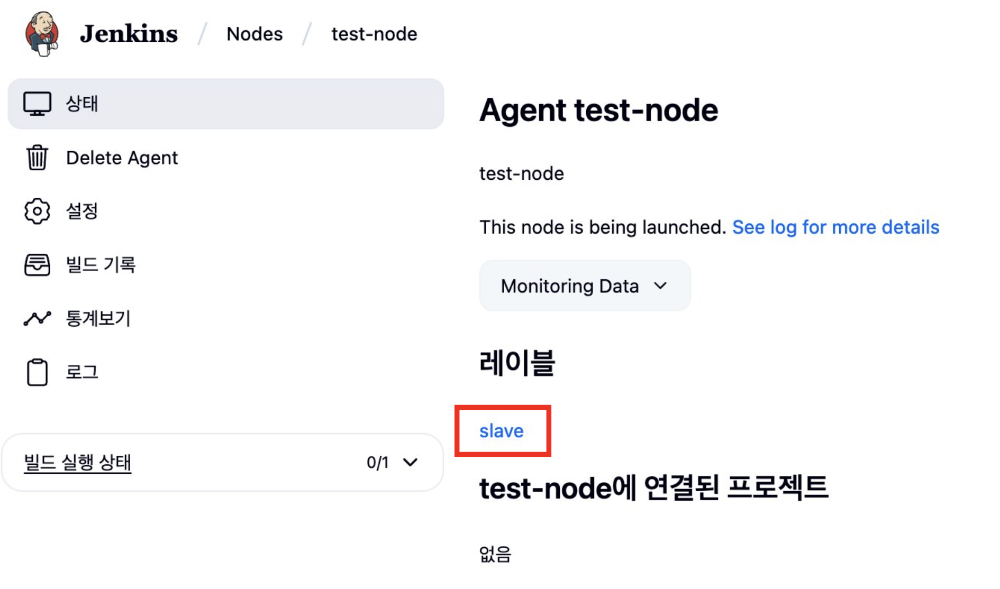
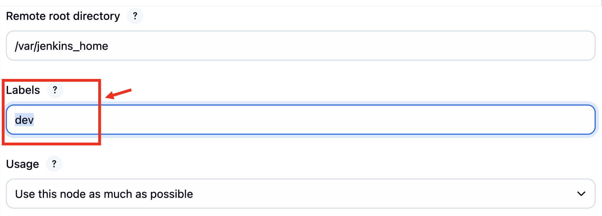
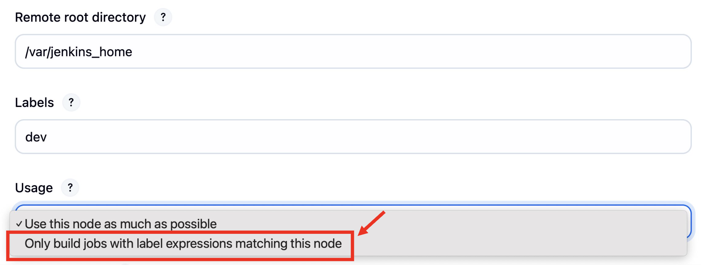
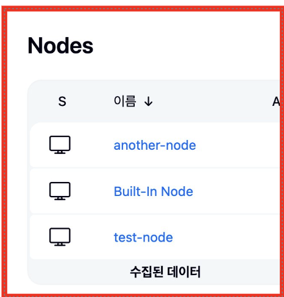
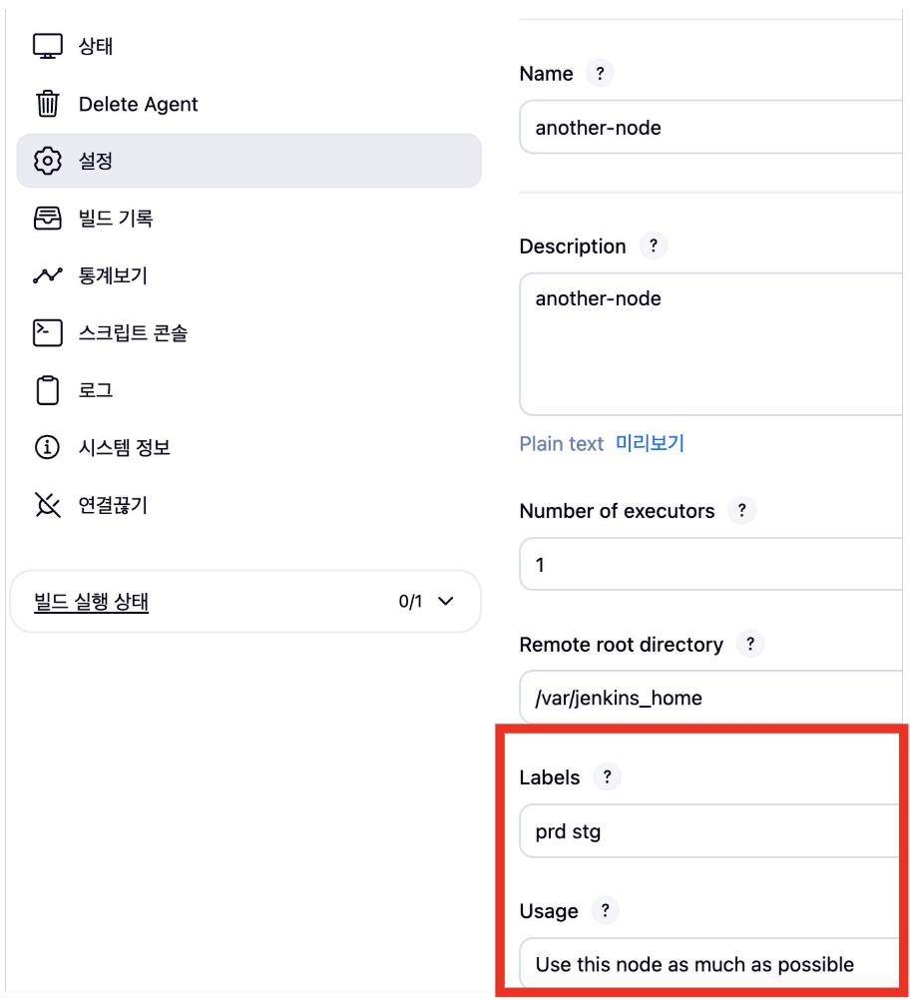
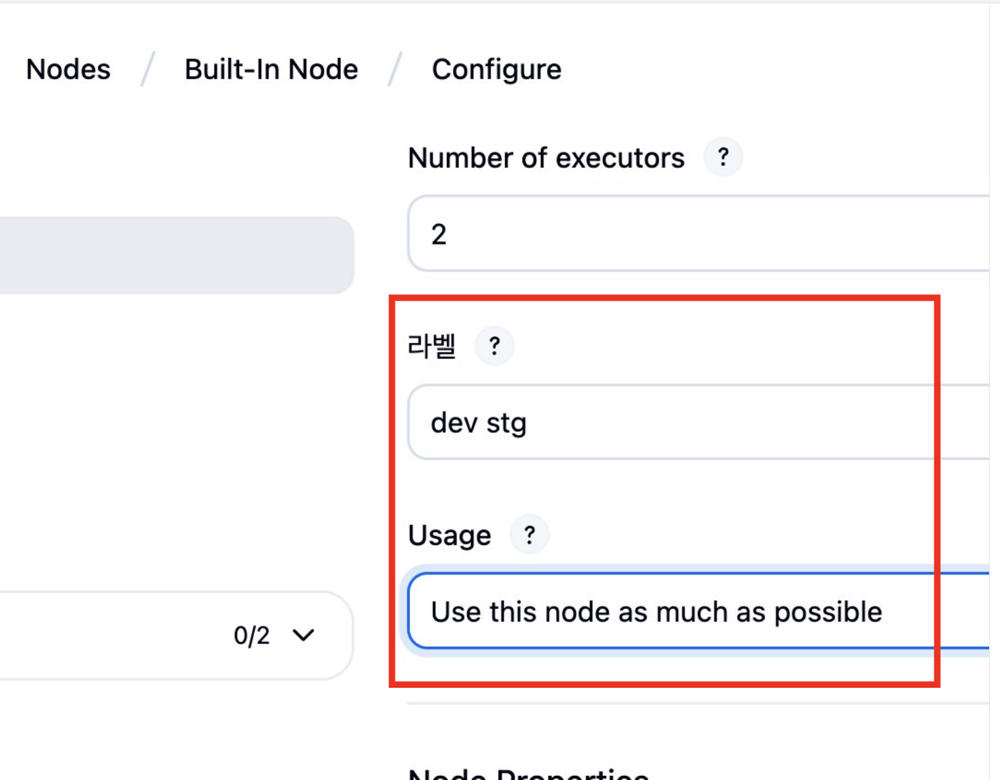
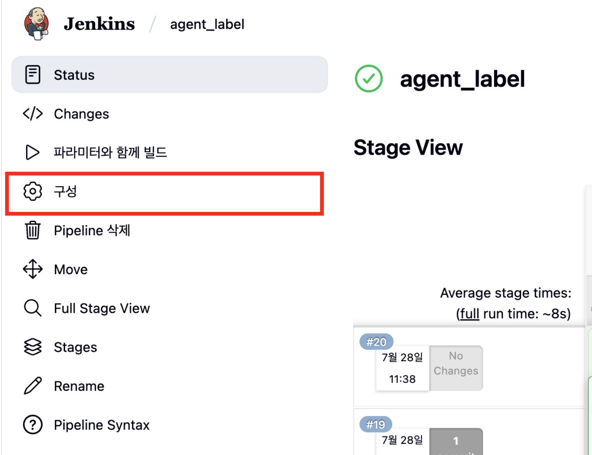
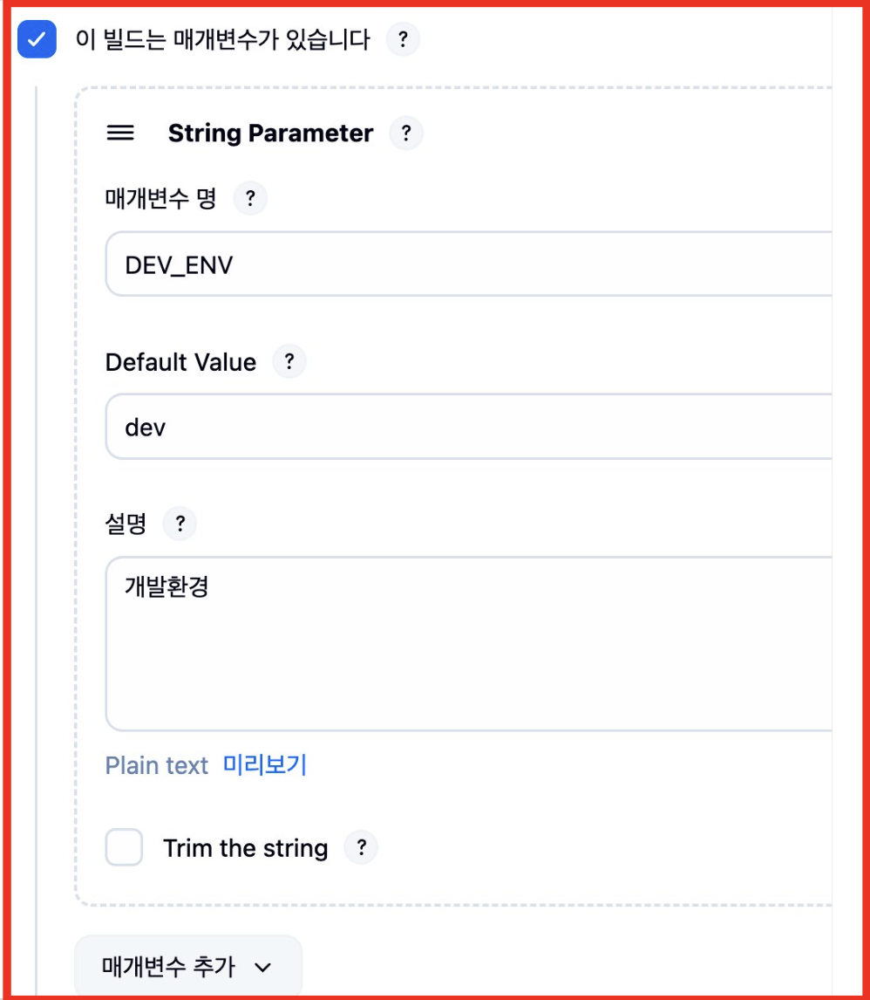
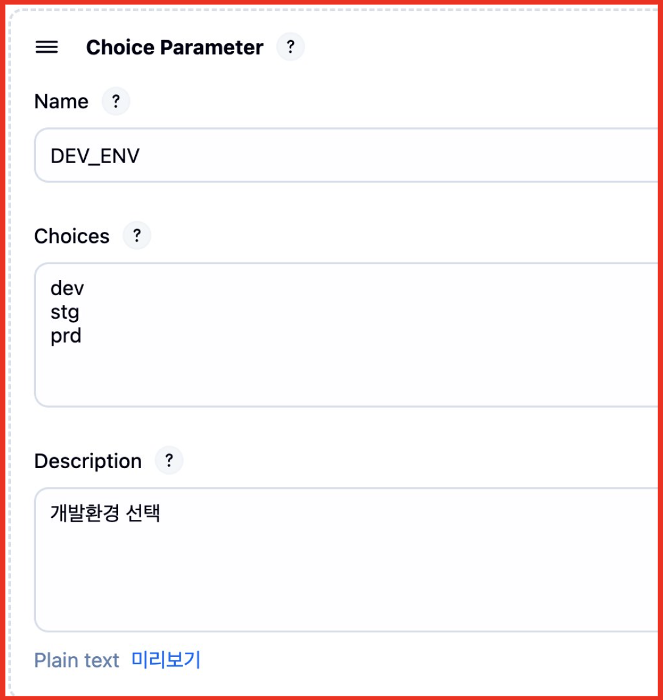

# Jenkins Pipeline Agent 지정하기 (+빌드 시 Agent 동적으로 할당하기)

## 1\. 개요

Jenkins를 사용하다보면 여러 개발환경을 세팅하게 될 때 각기 다른 설정값을 지정해야 하는 번거로움이 작용할 수 있습니다.

_방화벽에 의해 막히거나, 프로젝트 규모가 다르거나, 패치 속도가 빨라야 하거나..._

이럴 때, Jenkins Pipeline이 실행되는 **Agent를 지정**하여 개발환경 맞춤형으로 pipeline 설계하는 방법에 대해서 알아보겠습니다.

## 2\. 목표

1\. Jenkins pipeline에서 **특정 Agent 지정하기**

2\. 상황에 따라서 Jenkins **Agent를 지정하는 분기점 만들기**

## 3\. 알아보기 : Jenkins Agent란?

Jenkins를 사용할 때 Agent를 연결하면 여러 장점이 있습니다.

Jenkins Agent를 통해 얻을 수 있는 장점은 다음과 같습니다.

**1\. 작업(JOB)을 분산하여 처리할 수 있다.**

  - Jenkins master의 과부하를 방지할 수 있다.

  - 많은 JOB을 처리하기 위해 Agent(node)를 추가하여 scale out을 할 수 있다.

**2\. 환경을 세팅할 수 있다.**

  - OS, 소프트웨어(Docker, Java version, argocd 등)의 설치 여부나 버전을 다르게 세팅할 수 있음

  - 민감정보나 스크립트 파일 등을 격리하여 사용 가능함

등의 여러 장점을 가지고 있습니다.

## 4\. 주제1. Jenkins pipeline에서 agent 지정하기

이전 'Jenkins agent' 설치 포스팅에서 Label값을 'slave'로 설정하였습니다. (Jenkins관리 - Nodes - {노드})



이 Label값을 수정하는 방법을 살펴봅시다. (설정 - Label값 수정 - Save)

저는 개발환경이 'dev'라는 가정하에 'dev'라는 Label으로 수정했습니다.



_+@ 만약 해당 노드가 'dev' 개발환경 전용으로 쓰이고 싶어!  
라고 한다면 'Usage' 부분을 'only build jobs with label expressions matching this node' 으로 선택해줍니다._

_(Usage - 'only build jobs with label expressions matching this node' - Save)_



이로서 해당 pipeline에서 'dev' Label인 agent를 사용하라고 명시 해야만 해당 노드에서 작업이 진행됩니다.

Jenkinsfile에 아래와 같이 설정한다면 빌드를 진행할 때 'dev' 라벨로 잡혀있는 노드에서 빌드가 실행되게 됩니다.

```
pipeline {
    // 이 부분에서 agent label을 지정한다!
    agent {
    label "dev"
    }
// pipeline Step 
    stages {
        stage('Git Pull') { 
            steps {
                ...
            }
        }
        
        stage('Build') { 
            steps {
                ...
            }
        }
    
        stage('Run') { 
            steps {
                ... 
            }
        }
    
    }
}
```

## 5\. 주제2. agent 지정 시 분기점 만들기

아래와 같은 예제를 가지고 세팅을 진행하겠습니다.

\- **개발환경에 따른 Agent분리**

  - **dev** : test-node agent 사용

  - **prd**, **stg**, 그 외 : 다른 agent 혹은 master jenkin(built-in) 사용

**step1.** test-node에 Label을 'dev'로 수정 (위 과정과 동일하므로 생략)

**step2.** 그 외 다른 agent와 built-in agent의 label을 수정함

  - Label을 여러개 부여하고 싶을 땐, 공백(띄어쓰기)로 구분하면 됩니다.



다른 Agent와 마스터 노드(Built-in node)의 Label을 수정합니다. (**prd**, **stg**)





그 이후 Jenkins Pipeline의 기능인 파라미터(parameter)를 사용하여 Agent Label을 동적 변수로 사용해 봅시다.

\- Jenkins Item에서 파라미터 추가하기 (String parameter)

1) Item - 구성 - '이 빌드는 매개변수가 있습니다'



2) String Parameter 추가



 2\*) 혹은 Choice Parameter로 추가합니다 (권장 : 필수 파라미터이기 때문에 오타 등을 방지할 수 있습니다.)



3) pipeline code 수정 (label 부분에 파라미터 값 입력)

```
pipeline {
    // 이 부분에서 agent label을 지정한다!
    agent {
    // 파라미터값을 가져와서 label을 임의로 넣는다
    label "${params.DEV_ENV}"
    }
// pipeline Step 
    stages {
        stage('Git Pull') { 
            steps {
                ...
            }
        }
        
        stage('Build') { 
            steps {
                ...
            }
        }
    
        stage('Run') { 
            steps {
                ... 
            }
        }
    
    }
}
```

이후 dev, stg, prd를 원하는 방식으로 변경하면서 Run을 해보면 세팅값에 맞춰서 알맞은 Agent에서 실행되는 것을 확인할 수 있습니다.

### 6\. 결론

본 포스팅을 통해서

1\. 환경에 맞게 세팅된 Agent를 Jenkins pipeline에 선언하여 특정 Agent를 사용할 수 있으며

2\. 파라미터 기능을 이용하여 Agent를 동적으로 선언하여 사용할 수 있게 되었습니다.