# AWS ALB+ACM을 사용하여 인증서 적용하기

AWS ALB와 ACM을 활용한 HTTPS/인증서 적용 관련 내용을 다룹니다.
웹 서비스를 호스팅할 때 HTTPS를 적용하려면 주로 Nginx 등을 사용하여 SSL/TLS 인증서를 직접 설정합니다.

하지만 AWS 환경에서는 ALB와 ACM을 활용해 보다 간편하게 인증서를 적용할 수 있습니다.

**<순서>**

**1\. ACM발급하기**

**2\. 대상그룹 생성하기**

**3\. 로드밸런서 세팅하기**

**4\. Route53 레코드 생성하기**

**5\. +@**

### **1\. ACM 발급하기**

\- ACM 인증서는 AWS에서 직접 발급받거나, 외부에서 발급한 인증서를 가져오는 방식으로 구성할 수 있습니다.

\- ALB에 연결할 인증서를 사용할 경우, **ACM 인증서와 ALB는 반드시 같은 리전**에 있어야 합니다.

### **2\. 대상 그룹 생성하기**

로드밸런서로 들어오는 트래픽을 전달할 **'대상'**을 지정하는 역할입니다.

인스턴스, Lambda 등 원하는 목적지를 설정할 수 있습니다.

#### **2-1) AWS - EC2 - (좌측 사이드바)로드 밸런신 - 대상 그룹 접속 - 대상 그룹 생성**

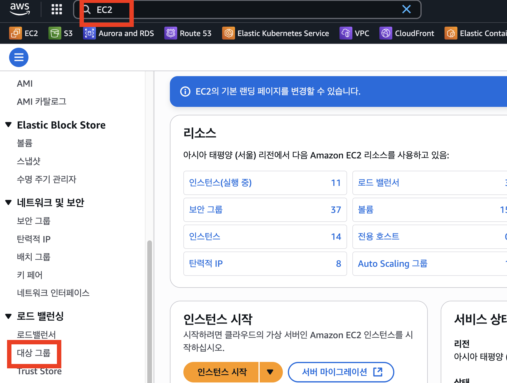

#### **2-2) 대상 그룹 생성하기**

-   **대상 유형 선택 :**  
    클라이언트의 요청을 보내줄 목적지를 지정합니다.  
    EC2 인스턴스에 호스팅된 웹 서비스로 요청을 보내기 위하여 **'인스턴스'**로 지정하여 진행합니다.

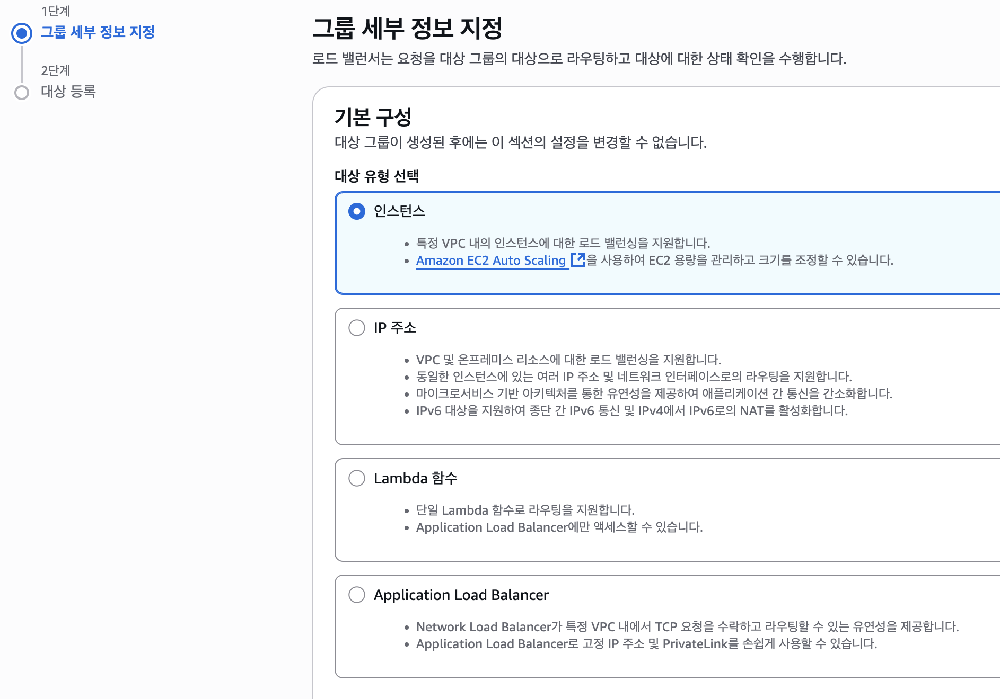

-   **프로토콜 :**   
    대상 그룹의 프로토콜은 **ALB가 백엔드 애플리케이션과 통신할 방식**을 의미합니다.  
    일반적으로 **클라이언트 ↔ ALB 구간은 HTTPS**, **ALB ↔ 애플리케이션 구간은 HTTP**로 구성합니다.  
    따라서 EC2 인스턴스의 웹 서비스가 8080 등 일반 포트에서 동작한다면 **HTTP 프로토콜**로 설정합니다.  
      
    

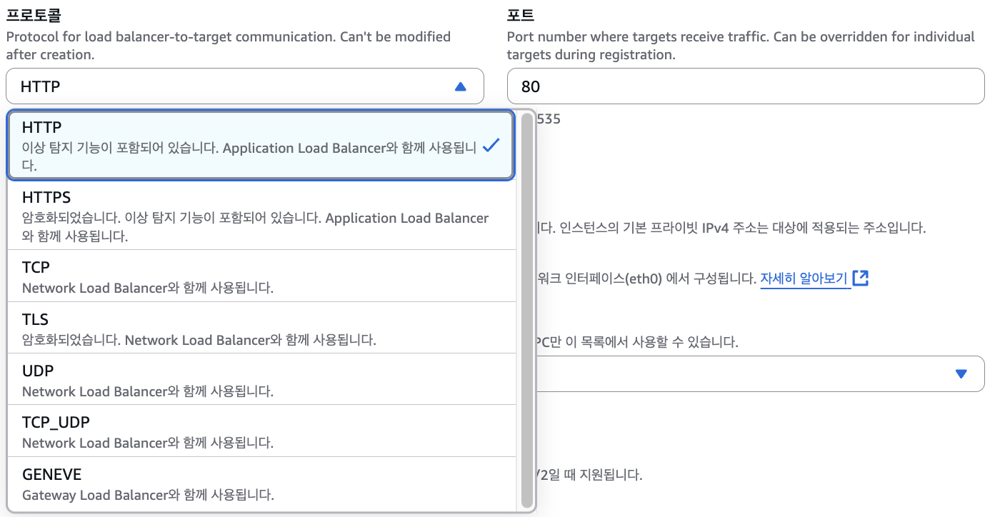

-   **VPC, 프로토콜 버전 :**   
    ALB는 VPC 내에서 동작하므로 대상 그룹의 VPC는 **목적지 인스턴스와 동일한 VPC**로 설정합니다.  
    프로토콜 버전은 일반적인 웹 서비스 기준으로 기본값을 사용해도 무방합니다.  
      
    
-   **상태검사**  
    애플리케이션이 정상적으로 응답하는지 확인하기 위한 설정입니다.  
    보통 Spring Boot 등의 서비스에서는 `/actuator/health` 같은 Health Check 엔드포인트를 사용합니다.

#### **2-3) 대상 등록**

-   **사용 가능한 인스턴스**  
    웹 서비스가 호스팅 되고 있는 인스턴스를 선택합니다.
-   **선택한 인스턴스를 위한 포트**  
    웹 서비스가 호스팅 되고 있는 포트를 입력합니다. (ex. Springboot 8080 등등)
-   **아래에 보류 중인 것으로 포함 :** 클릭  
      
    

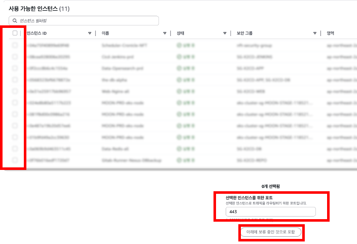

#### 2-4) 대상 그룹을 생성하면 지정한 포트와 애플리케이션 응답 상태를 기준으로 Health Check가 수행됩니다.

### **3\. 로드밸런서 세팅하기**

클라이언트의 요청을 설정한 대상으로 트래픽을 분산하거나, 전달하는 역할을 합니다.

로드밸런서에는 ALB, NLB, CLB가 존재합니다.

이 중 웹 서비스(HTTP(s))는 ALB가 사용됩니다.

#### **3-1) 로드밸런서 생성하기**

AWS - EC2 - (좌측 사이드바)로드 밸런싱 - 로드밸런서 - 로드 밸런서 생성 - Application Load Balancer

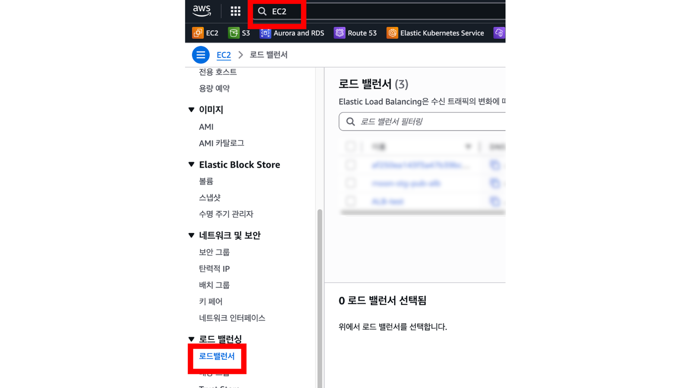

#### **3-2) 기본 구성**

외부 사용자의 HTTPS 접속을 처리하는 것이 목적이므로 **'인터넷 경계'**를 선택합니다.  
반대로 VPC 내부에서만 사용하는 로드밸런서라면 **'내부'** 유형을 선택합니다.

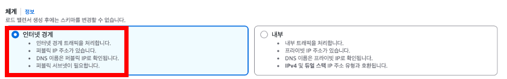

#### **3-3) 네트워크 매핑**

-   **VPC :** 2)에서 설정한 대상그룹과 같은 VPC로 설정합니다.
-   **IP 풀 :** 일반적인 구성에서는 기본값으로 진행해도 무방합니다.
-   **가용 영역 및 서브넷**  
    **가용 영역 :** 최소 2개 이상의 가용 영역을 선택하여 가용성을 확보합니다.  
    **서브넷 :** 인터넷 경계용 ALB라면 일반적으로 **퍼블릭 서브넷**을 선택합니다. 즉, 인터넷 게이트웨이와 연결된 서브넷을 사용하는 것이 일반적입니다.

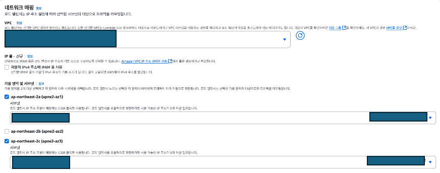

-   **보안그룹 & 리스너**  
    **리스너 :** 일반적인 HTTPS 접속을 처리하려면 443포트를 지정하고, 2)에서 만든 대상그룹을 지정합니다.  
    **\*1)보안그룹 :** 리스너에 지정한 프로토콜(ex. HTTPS(443))이 인바운드 허용된 보안 그룹을 설정합니다.  
      _인스턴스에 지정된 보안그룹에 유의해야합니다. 아래에 후술._

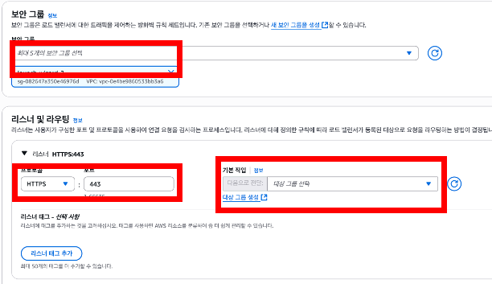

-   **보안 리스너 설정**  
    HTTPS 리스너를 통해 암호화된 트래픽 처리를 위하여 인증서를 선택합니다.  
    ACM 인증서를 선택할 때는 해당 인증서가 현재 접속하려는 도메인 또는 서브도메인을 포함하는지 확인합니다.  
    예를 들어 와일드카드 인증서(`*.example.com`)라면 서브도메인 구성에 유용합니다.

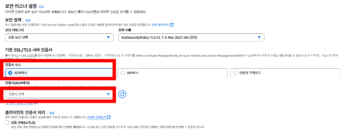

-   **로드밸런서 생성 버튼 클릭**

#### **3-4) 로드밸런서 정보 확인하기**

-   **리소스 맵**  
    리소스맵을 보면 트래픽이 어떤 식으로 처리되는지 시각적으로 확인 가능합니다.  
    리소스맵의 '대상' 영역에서는 초기 설정 완료 후 Health Check 결과를 확인할 수 있습니다.
-   **DNS 이름 (=임시 DNS)**  
    정상적으로 연결되었는지 확인하려면 DNS 이름을 복사해 브라우저에서 먼저 접속 테스트를 진행해볼 수 있습니다.

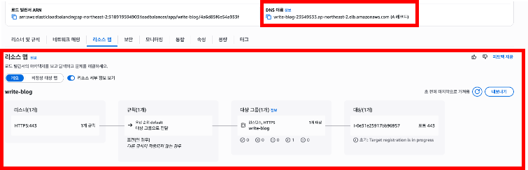

### **4\. Route53 레코드 생성하기**

~3 까지 세팅한 로드밸런서(ALB)를 이제 도메인 레코드를 지정해봅시다.  
ALB에 인증서가 연결되어 있다면, Route53에서는 보통 **별칭(Alias) A 레코드**로 ALB를 연결합니다.

-   **레코드 이름**  
    ACM에 등록된 인증서가 와일드카드 인증서라면 서브도메인 지정이 가능합니다.
-   **트래픽 라우팅 대상**  
    1) 별칭 체크  
    2) Application Load Balancer에 대한 별칭  
    3) 리전 선택  
    4) ~3까지 세팅한 로드밸런서 선택  
    5) 레코드 생성

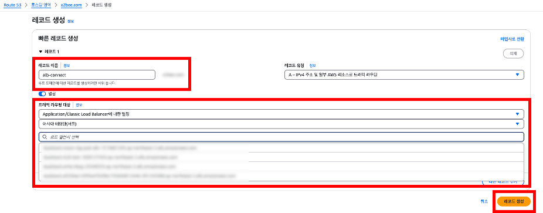

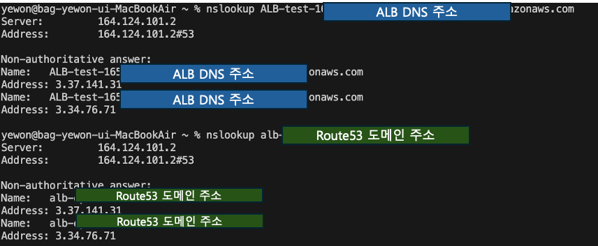

### **+@  보안그룹에 대하여**

\*1) 로드밸런서를 통해 인스턴스에 연결할 때 인스턴스에 연결된 보안그룹에 유의해야합니다.

인스턴스 입장에서는 외부 클라이언트의 요청을 직접 받는 것이 아니라, **로드밸런서를 통해 전달된 요청**을 받습니다.

따라서 인스턴스 보안그룹의 인바운드 규칙에 서비스포트 지정 시 **'소스'를 '로드밸런서의 보안그룹'** 으로 지정해야합니다.

**@1) 로드밸런스에 지정된 보안그룹 (443 허용)**

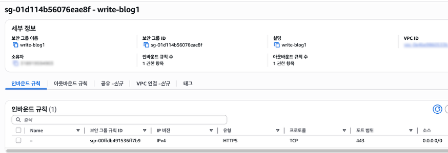

  
**@2) 인스턴스 보안그룹**  
 - 443 포트 허용이 아닌, 8080포트 허용

 - 허용 대상(소스)는 로드밸런서의 보안그룹으로 지정함.

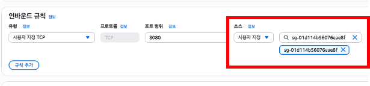