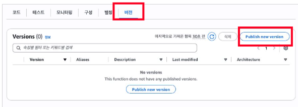
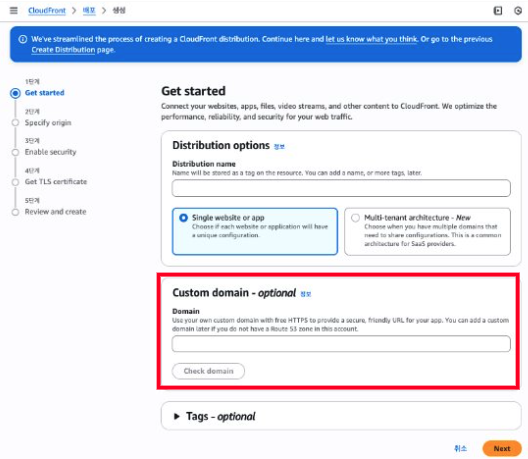
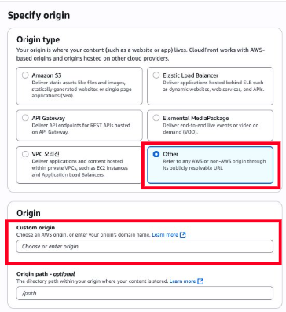
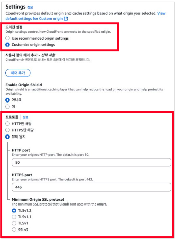
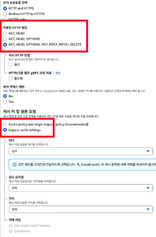
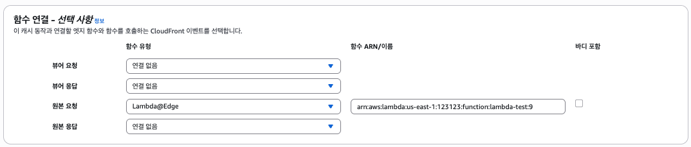
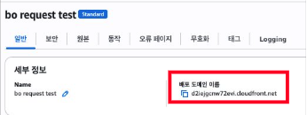
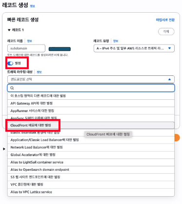

# 도메인마다 포트가 다른 서버? CloudFront + Lambda@Edge로 해결하기

## 1. 개요

웹 서비스를 호스팅할 때는 주로 Nginx 리버스 프록시 등을 통해 라우팅하는 방식을 사용합니다.

혹은 클라우드 서비스를 이용한다면 대표적으로 AWS ALB(Application LoadBalancer)을 사용합니다.

다만, Nginx용 서버(인스턴스)를 사용하게 될 때 Nginx서버 장애에 취약하는 위험성이 있으며

안정성을 챙기기 위해 ALB를 사용할 경우 비용이 다소 높게 책정될 수 있습니다.

이를 보완하기위해 포스팅 주제인 CloudFront + Lambda@Edge를 활용한 배포를 서술하려고 합니다.

|   | Nginx용 서버(인스턴스) | ALB | CloudFront + Lambda@Edge |
| --- | --- | --- | --- |
| 비용 | 낮음 | 높음 | 중간 |
| 안정성 | 취약 | 안정 | 중간 |
| 복잡도   (난이도) | 낮음 | 중간 | 높음 |

_개인적으로 생각하는 각 방식 특징 비교_

### **Step1. Lambda@Edge 함수 생성**

\* Lambda와 구조 자체는 동일합니다. 다만, Lambda@Edge는 Cloudfront의 요청~처리 과정 중 동적으로 처리를 진행하기 위한 Cloudfront 전용 Lambda라고 생각해도 좋습니다.

\* Lambda@Edge는 '버지니아 리전'에서만 구성됩니다.

\* 다만 함수 호출 자체는 사용자와 가까운 리전에서 호출되기에 cloudwatch로그는 해당 리전에서 확인하면 됩니다.

\- 실행 역할 : Lambda@Edge 권한

\- 함수 입력 + Deploy

 예시)

더보기

```
// x86_64, node22.x

'use strict';

// CloudFront에서 custom domain을 입력받으면 origindomain : port 로 매핑
const domainOriginMap = {
  'cf-bo.domain.com': {
    host: 'custom.domain.com',
    port: 8080,
    useHttps: false
  },
  'cf-fo.domain.com': {
    host: 'custom.domain.com',
    port: 8081,
    useHttps: false
  },
  'cf-api.domain.com': {
    host: 'custom.domain.com',
    port: 8082,
    useHttps: false
  }
};

exports.handler = async (event) => {  
  const request = event.Records[0].cf.request;
  const headers = request.headers;
  const hostHeader = headers['host']?.[0]?.value;
  
  console.log('Original headers:', headers);

  const originConfig = domainOriginMap[hostHeader];

  if (!originConfig) {
    console.log('Domain not found');
    return {
      status: '403',
      statusDescription: 'Forbidden',
      body: `Domain ${hostHeader} not allowed`
    };
  }

  console.log('Origin config found:', originConfig);
       
  // 기본 origin 설정
  const customOrigin = {
    domainName: originConfig.host,
    port: originConfig.port,
    protocol: originConfig.useHttps ? 'https' : 'http',
    sslProtocols: ['TLSv1.2'],
    path: '',
    readTimeout: 20,
    keepaliveTimeout: 5    
  };
      
  request.origin = { custom: customOrigin };
  request.headers['host'] = [{ key: 'host', value: originConfig.host }];

  console.log('Origin configured:', customOrigin);  
  
  return request;
};
```

\- 버전 지정 : CloudFront에서 호출하기위해 Public version 생성



### **Step2. Cloudfront배포 세팅 : 도메인 주소는 AWS계정의 Route53에 등록되어 있어야함.**

#### 2-1) Custom Domain 입력



#### 2-2) Origin Domain 입력



#### 2-3) Origin(원본) 설정값 수정

 : Origin Domain(실제 서비스 실행 서버)로 요청값을 넘겨줘야 하기에 customize origin settings를 통해 헤더 및 프로토콜 등 조정

\- 프로토콜 : 뷰어 일치를 통해 HTTP(s)연결



#### 2-4) WAF, ACM 세팅 (생략)

#### 2-5) 생성된 배포 -> '동작' 편집

 : Nginx에서 CORS나 캐시 등의 설정값을 수정하는 것과 같은 부분이라고 보면 됩니다.

\- HTTP Method 모두 허용함

\- 원본(Origin)으로 통신이 원활하게 되기위해 캐시 관련 설정을 '모두'로 변경함



#### 2-6) Lambda@Edge 연결

 : Custom Domain 요청을 확인하여 Lambda함수로 전달하여 리디렉션을 해주기 위해 '원본 요청'에서 수행

\- Lambda ARN을 입력하고 마지막에 콜론(:)과 Public 버전 번호를 입력한다. (ex. arn~~~:9)


  
CloudFront가 동작하는 과정은 아래와 같습니다.

(1) 뷰어 요청 : 클라이언트 -> Custom Domain 요청  
(2) 원본 요청 : Cloudfront -> Origin 수행 직전  
(3) 원본 응답 : Origin 응답 직후  
(4) 뷰어 응답 : 최종 응답 후

### **Step3) Route53 도메인 설정**

도메인은 2가지 종류를 지정합니다.

(1)Custom Domain : 사용자가 접속할 주소

(2)Origin Domain : 실제 서비스가 실행되고 있는 주소

| 항목 | Custom Domain | Origin Domain |
| --- | --- | --- |
| 사용자 입장 | 접속하는 도메인 | 모르는 도메인 |
| Cloudfront 입장 | 요청 수신 주소 | 요청 전달할 주소 |
| 역할 | 클라이언트 <-> CloudFront | CloudFront <-> 오리진 서버 |
| 예시 | custom.domain.com | real.domain.com:8080 |
| 도메인 | \- 도메인 필요 O   \- Alias를 통해 Cloudfront로 라우팅 | \- 도메인 필요 ▵   \- 정적 호스팅 등은 불필요하나,   \- 본 포스팅 방식에서는 Origin Domain이      실제 서버로 라우팅 되어야함. |

#### 3-1) CloudFront 배포 도메인 확인 및 복사



#### 3-2) Route53에서 Custom Domain 라우팅 등록

 : 3-1에서 복사한 '배포 도메인 이름'을 입력



#### 3-3) Route53에서 Origin Domain 라우팅 등록

 : A레코드 등을 통해 서버에 직접 연결

### **리소스 맵**

```
[사용자 브라우저]
        |
        | ① 요청
        v
 ┌────────────────────────────────────────┐
 │             Custom Domain              │ ← 사용자가 접속 시도할 서버
 │           custom.domain.com            │ ← Route53 A/CNAME → CloudFront
 └────────────────────────────────────────┘
        |
        | ② DNS Resolution
        v
 ┌────────────────────────────────────────┐
 │              CloudFront                │
 │   Domain: dxxxx.cloudfront.net         │
 │   Aliases: custom.domain.com           │ 
 └────────────────────────────────────────┘
        |
        | ③ Origin Request 이벤트 발생
        v
 ┌────────────────────────────────────────┐
 │             Lambda@Edge                │
 │     (Origin Request trigger)           │
 │  - cf-bo.domain.com → port 9032        │
 │  - cf-fo.domain.com → port 9033        │ ← domain:host+port 매핑
 │  - cf-api.domain.com → port 9034       │
 └────────────────────────────────────────┘
        |
        | ④ 실제 오리진으로 전달
        v
 ┌────────────────────────────────────────┐
 │             Origin Server              │ ← 실제 서비스 실행되는 서버
 │          origin.domain.com:9032        │ ← Route53 A/CNAME
 └────────────────────────────────────────┘
```