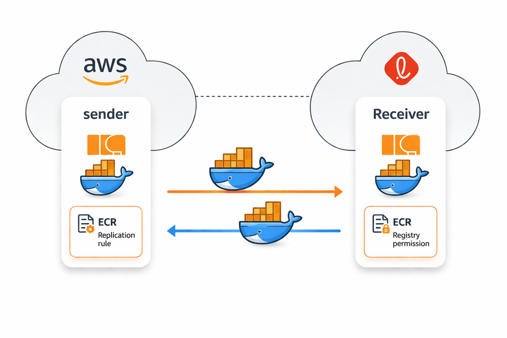

# AWS ECR Cross Account 이미지 미러링 구성 및 트러블슈팅

CI/CD 과정에서 빌드된 이미지를 다른 AWS 계정으로 전달하기 위해  
ECR Cross Account Replication을 구성하며 겪은 과정과 주의사항을 정리합니다.

---

## 문제/상황

기존 구조에서는 빌드된 Docker 이미지를 직접 전달하거나,  
대상 계정이 외부 ECR에서 직접 pull하는 방식으로 배포가 이루어졌습니다.

이 방식에는 다음과 같은 문제가 있었습니다.

- 배포 시 외부 네트워크 의존성 발생
- 이미지 전달 과정이 수동 또는 복잡
- 배포 시간이 길어짐

특히 특정 고객사 환경에서는 내부 계정에서만 이미지를 사용하는 구조가 필요했습니다.

---

## 해결 방법 / 개요

AWS ECR의 replication 기능을 사용하여  
이미지를 자동으로 다른 계정으로 복제하는 구조를 구성했습니다.

구성 요소:

- Source 계정 ECR (이미지 push)
- Destination 계정 ECR (이미지 수신)
- Cross Account Replication Rule
- Registry Permission 설정

아래 그림처럼 source 계정의 ECR에 이미지가 push되면, replication rule에 따라 destination 계정의 ECR로 이미지가 복제됩니다.
이때 destination 계정에서는 registry permissions를 통해 source 계정의 복제를 허용해야 합니다.



## 아키텍처 / 흐름

```
[CI/CD] → [Source Account ECR] → [Replication] → [Destination Account ECR] → [Deploy]
```

---

## 사전 준비

- 두 AWS 계정 존재 (Source / Destination)
- 복제를 구성할 리전 확인 (예: ap-northeast-2)
- ECR 사용 가능 상태
- 대상 계정에 registry permission 설정 가능

---

## 1. Source 계정(ECR) Replication Rule 설정

```yaml
rules:
  - destinations:
      - region: ap-northeast-2
        registryId: <destination-account-id>
    repositoryFilters:
      - filter: sample-team/sample-registry
        filterType: PREFIX_MATCH
```

설명

- 특정 prefix (`sample-team/sample-registry`)를 가진 repository만 복제
- 대상 계정의 `registryId` 지정
- 동일 rule로 여러 계정에 동시에 복제 가능

### 1-1) Repository Filter

```yaml
filter: sample-team/sample-registry
```

이 설정을 통해 다음과 같은 repository만 복제됩니다.

```
sample-team/sample-registry/frontend
sample-team/sample-registry/backend
```

### 1-2) Multi Account Replication

하나의 rule에서 여러 destination을 설정할 수 있습니다.

```yaml
destinations:
  - registryId: <destination-account-id-1>
  - registryId: <destination-account-id-2>
```

---

## 2. Destination 계정 Registry Permission 설정

Replication을 위해서는 destination 계정에서  
Source 계정에 대한 권한을 허용해야 합니다.

```json
{
  "Sid": "copy_registry",
  "Effect": "Allow",
  "Principal": {
    "AWS": "arn:aws:iam::<source-account-id>:root"
  },
  "Action": [
    "ecr:CreateRepository",
    "ecr:ReplicateImage"
  ],
  "Resource": "arn:aws:ecr:ap-northeast-2:<destination-account-id>:repository/sample-team/sample-registry/*"
}
```

설명

- Source 계정이 repository 생성 및 이미지 복제를 수행할 수 있도록 허용
- 특정 prefix에 대해서만 권한 부여 가능

---

## 3. 이미지 Push 및 복제 확인

```bash
docker push <source-account-id>.dkr.ecr.ap-northeast-2.amazonaws.com/sample-team/sample-registry/frontend:test
```

설명

- Replication rule 생성 이후 push된 이미지부터 복제됨
- 새로운 tag로 push하여 테스트 필요
- 필요한 권한이 있으면 destination 계정에 repository가 자동 생성될 수 있음

---

## 참고

### 1. Replication은 기존 이미지에 적용되지 않음

- rule 생성 이전 이미지 → 복제되지 않음
- 반드시 신규 push 필요

---

### 2. Repository prefix 구조 중요

```
sample-team/sample-registry/*
```

prefix가 다르면 replication 대상에서 제외됩니다.

---

### 3. 리전 구성 확인

- 예시에서는 같은 리전을 기준으로 설명했지만, ECR replication은 cross-region 구성도 가능
- 다만 운영 시에는 리전과 계정 조합을 먼저 확정한 뒤 rule을 작성하는 편이 관리하기 쉬움

---

### 4. Registry Permission 위치

```
ECR → Private registry → Permissions
```

- Repository policy가 아님
- Registry permission에 설정해야 정상 동작

---

### 5. Resource ARN 범위

```
repository/sample-team/sample-registry/*
```

- 특정 repository prefix만 허용 가능
- 불필요한 repository 복제 방지

---

### 6. 가장 많이 발생하는 문제 (실제 케이스)

- Account ID 또는 prefix 오기입

```
<destination-account-id-typo> (오기입)
<destination-account-id> (정상)
```

Replication rule 자체는 정상이어도  
destination account ID나 repository prefix가 다르면 복제가 수행되지 않습니다.

---

## 정리

| 항목 | 내용 |
| --- | --- |
| 핵심 기능 | ECR Cross Account Replication |
| 목적 | 이미지 자동 복제 |
| 주요 구성 | Replication Rule + Registry Permission |
| 필터링 | Repository Prefix 기반 |
| 주의사항 | Account ID, 신규 push, 권한 위치 |

ECR replication을 사용하면  
CI/CD와 배포 구조를 단순화하고, 계정 간 이미지 전달을 자동화할 수 있습니다.
