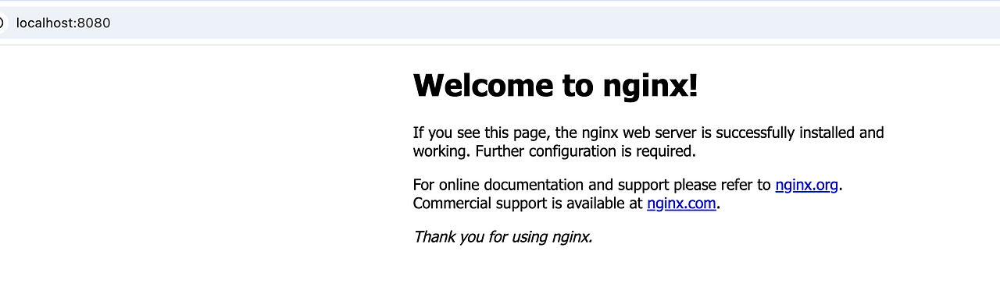

# Docker 아키텍처를 구성해보자 (#1. Docker Hub 이미지로 서비스 배포하기)
Docker Hub의 공식 이미지를 이용해 가장 빠르게 서비스를 띄워보는 실습
---

이 글은 아래 조건을 전제로 합니다.

1. Docker가 설치되어 있다.
2. Docker의 개념에 대해서 어렴풋이 알고 있다.

## 1. Docker Hub에서 공식 이미지 사용하기

Docker Hub에는 전 세계에서 사용되는 다양한 오픈소스 이미지가 등록되어 있습니다.

대표적으로 아래와 같은 이미지들이 있습니다.

| 이미지 | 설명 |
| --- | --- |
| `nginx` | 웹 서버 |
| `mysql` | 데이터베이스 |
| `redis` | 캐시 서버 |

이번에는 가장 단순하고 시각적으로 바로 결과를 확인할 수 있는 예제,
즉 `nginx` 이미지를 이용해 웹 서버를 띄워보겠습니다.

이 과정은 Docker를 처음 접할 때
**"이미지를 가져와서 컨테이너로 실행하면 서비스가 바로 뜬다"**
는 감각을 익히기에 꽤 좋습니다.

---

## 2. Nginx 실행하기

터미널에서 아래 명령어를 입력합니다.

```bash
docker pull nginx
```

먼저 Docker Hub에서 `nginx` 이미지를 내려받습니다.

그 다음 실제 컨테이너를 실행합니다.

```bash
docker run -p 8080:80 nginx
```

옵션을 간단히 보면,

- `-p`: 포트 매핑 옵션
- `8080:80`: 호스트의 8080 포트를 컨테이너의 80 포트와 연결

즉,
내 PC의 `localhost:8080`으로 들어온 요청을
컨테이너 내부의 Nginx 웹 서버(80포트)로 전달하겠다는 뜻입니다.

이 명령어를 실행하면 Nginx 웹 서버가 자동으로 다운로드되고,
곧바로 실행됩니다.

---

## 3. 결과 확인하기

브라우저에서 아래 주소로 접속해봅시다.

```text
http://localhost:8080
```

잠시 후 아래와 같이 **"Welcome to nginx!"** 화면이 보이면 정상입니다.



설치도, 복잡한 설정도 없이 바로 웹 서버가 동작한 것입니다.

이 과정은 결국,
누군가가 미리 만들어둔 오픈소스 환경(= 이미지)을 그대로 가져와
내 환경에서 빠르게 실행한 것이라고 보면 됩니다.

즉 Docker의 가장 큰 장점 중 하나는
**환경 구성을 처음부터 손으로 세팅하지 않아도,
검증된 실행 환경을 이미지 형태로 재사용할 수 있다는 점**입니다.

---

## 4. 정리

이번 실습에서 핵심은 아래와 같습니다.

1. Docker Hub에는 다양한 공식 이미지가 존재한다.
2. `docker pull`로 이미지를 내려받을 수 있다.
3. `docker run`으로 이미지를 컨테이너로 실행할 수 있다.
4. 포트 매핑을 통해 내 PC 브라우저에서 서비스 확인이 가능하다.

Docker를 처음 사용할 때는
복잡한 아키텍처를 바로 구성하기보다,
이처럼 **공식 이미지 하나를 실행해보고 결과를 눈으로 확인하는 과정**이 가장 직관적입니다.

다음 단계에서는 여기서 더 나아가,
직접 만든 HTML 파일을 붙이거나 컨테이너를 조금씩 커스터마이징하면서
Docker 아키텍처를 확장해볼 수 있습니다.
