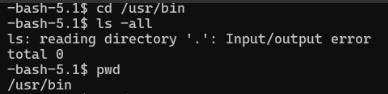
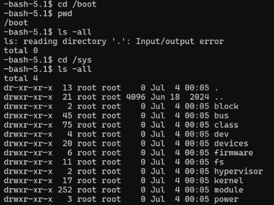

# 서버 디스크 수리 도구 fsck (File System Check)
디스크 I/O 오류 상황에서 파일시스템을 점검하고 복구할 때 사용한 경험을 정리해보았습니다.

---

## 1. 발단

CI/CD 서비스들이 올라가 있는 서버에 장애가 발생했다는 연락을 받고,
SSH로 Ubuntu 서버에 접속해보았습니다.

그런데 평소처럼 `user@host` 형태의 익숙한 프롬프트가 보이는 것이 아니라,
어딘가 불안한 `-bash-5.1$` 형태로 접속되었습니다.

조금 쎄한 느낌을 안고 점검을 시작했는데,
바로 아래와 같은 에러가 보였습니다.

```text
ls: cannot open directory '.': Input/output error
-bash: /usr/bin/lsblk: Input/output error
-bash: /usr/bin/df: Input/output error
```

평소 점검할 때 자주 사용하는 명령어들조차 제대로 동작하지 않았습니다.

몇 년 전 팀 내부 GitLab 서버를 한 번 크게 터뜨렸던 경험이 떠오를 정도로,
꽤 식은땀이 나는 상황이었습니다.

이번 글에서는 그때 어떤 식으로 상황을 판단했고,
결과적으로 `fsck`를 통해 어떻게 복구를 시도했는지 정리해보려고 합니다.

---

## 2. 상황 분석 시작

### 2-1. 명령어가 안 먹힌다고?

우리가 평소 사용하는 명령어는 결국 `/usr/bin` 같은 경로에 있는 실행 파일을 통해 동작합니다.

그런데 `ls`, `lsblk`, `df` 같은 기본 명령어조차 제대로 실행되지 않는다면,
단순히 셸 문제가 아니라 **파일시스템 자체를 정상적으로 읽지 못하고 있을 가능성**을 먼저 의심해볼 수 있습니다.



실제로 명령어 파일 경로 자체가 조회되지 않는 상태였고,
이 시점에서 “아, 이건 디스크 쪽이 꼬였을 수 있겠다”는 판단을 하게 되었습니다.

### 2-2. 그래도 SSH 접속은 되네?

한편으로는 SSH 접속 자체는 성공했습니다.

즉,

- 커널은 살아 있고
- 네트워크도 동작 중이며
- 시스템이 완전히 죽은 상태는 아니지만
- 특정 파일시스템 경로나 디스크 I/O에 문제가 생긴 상황

으로 볼 수 있었습니다.

결국 `/home/user`, `/usr/bin` 같은 경로를 읽어오지 못하는 것으로 보아,
운영체제 전체가 내려간 것이 아니라 **디스크 또는 파일시스템 계층에서 장애가 발생한 상태**에 가까웠습니다.

### 2-3. 그럼 재부팅하면 되지 않을까?

처음에는 역시 재부팅부터 떠올랐습니다.

그런데 혹시나 하는 마음에 `/boot` 디렉토리 상태도 함께 확인해보았습니다.



이 시점에서 든 생각은 단순했습니다.

> 재부팅했다가 `/boot`까지 읽지 못하면,
> 지금 접속해 있는 세션이 마지막 세션이 될 수도 있겠다.

즉,
성급하게 재부팅하기보다는,
부팅 경로와 파일시스템 상태를 더 조심스럽게 봐야 하는 상황이었습니다.

### 2-4. 파일을 옮기거나 로그를 볼 수는 없을까?

로그를 더 보거나,
중요 파일을 어딘가로 옮기거나,
백업이라도 해두고 싶었지만
이 역시 쉽지 않았습니다.

권한 에러와 I/O 에러가 섞여 나오면서,
정상적인 파일 접근 자체가 거의 불가능한 상태였기 때문입니다.

### 2-5. 그래서 어떻게 판단했나?

결국 당시 상황은
커널과 디스크 사이 어딘가에서 파일시스템 손상 또는 I/O 문제가 발생한 상태로 보였습니다.

따라서 안전하게 진단하고 수리하기 위해,
같은 버전의 Ubuntu 부팅 USB를 준비한 뒤
해당 장치로 부팅해서 문제 디스크를 점검하는 방향으로 접근했습니다.

이렇게 하면 최소한 `/boot`가 망가져 있더라도
현재 장애 디스크에 의존하지 않고 진단을 진행할 수 있습니다.

---

## 3. 의외로 단순했던 해결

문제가 생긴 디스크를 **언마운트한 상태**에서,
`fsck` 명령어로 파일시스템 검사 및 수리를 시도했습니다.

예를 들어 `fstab`에 아래처럼 잡혀 있었다면,

```text
UUID=xxxx / ext4 defaults 0 1
UUID=yyyy /home ext4 defaults 0 2
```

해당 파티션을 직접 대상으로 검사하게 됩니다.

상황에 따라 recovery mode나 Live USB 환경에서 아래와 비슷한 형태로 실행할 수 있습니다.

```bash
sudo fsck -y /dev/sdXN
```

또는 UUID를 확인한 뒤 적절한 디바이스를 대상으로 실행합니다.

```bash
lsblk -f
blkid
```

그리고 정말 의외로,
생각보다 빠르게 복구가 진행되었습니다.

처음에는 꽤 큰 장애처럼 느껴졌지만,
결과적으로는 파일시스템 무결성 검사와 복구만으로 정상화된 셈입니다.

---

## 4. fsck가 뭔데 이렇게 편하지?

`fsck`(`File System Check`)는 말 그대로,
**디스크 안의 파일시스템 구조를 검사하고 고쳐주는 도구**입니다.

서버가 갑자기 꺼지거나,
전원 장애가 발생하거나,
디스크에 쓰기 작업이 완전히 끝나기 전에 문제가 생기면,
파일시스템 내부 구조가 꼬일 수 있습니다.

이때 `fsck`는 그 꼬인 구조를 점검하고,
가능한 범위에서 정상 상태로 되돌리는 역할을 합니다.

대표적으로 아래와 같은 작업을 수행할 수 있습니다.

- ext4의 **저널(journal)** 확인 및 복구
- 고아 inode 정리 (`lost+found`로 이동될 수 있음)
- 손상된 슈퍼블록을 예비 슈퍼블록으로 복원 시도
- 블록 / inode 비트맵 불일치 수정
- 배드섹터를 건너뛰도록 표시

즉,
단순히 “디스크를 보는 명령어”가 아니라,
**파일시스템 자체를 수리하는 도구**에 가깝습니다.

---

## 5. 디스크는 왜 꼬이는 걸까?

디스크 또는 파일시스템이 꼬이는 대표적인 원인은 아래와 같습니다.

| 종류 | 사유 | 자주 보이는 문구 |
| --- | --- | --- |
| 비정상 종료 | 캐시 flush 전에 전원이 꺼짐 | `EXT4-fs error`, `journal replay` |
| 배드섹터 | 물리 블록 손상 | `I/O error`, `Buffer I/O error` |
| 디스크 부족 | 메타데이터 기록 실패 | `no space left on device` |
| 하드웨어 문제 | 케이블 / 컨트롤러 오류 | `ata1: hard resetting link` |
| 중복 접근 | 동일 파티션 다중 마운트 | `inode mismatch`, `directory entry corrupt` |

즉,
파일시스템 손상은 소프트웨어 문제일 수도 있지만,
실제로는 하드웨어 문제나 스토리지 상태 이상과 연결되는 경우도 꽤 많습니다.

그래서 `fsck`로 일단 복구가 되더라도,
근본 원인까지 함께 확인하는 것이 중요합니다.

---

## 6. 주의할 점

`fsck`는 편리하지만,
아무 상황에서나 바로 실행하면 안 됩니다.

특히 중요한 점은 아래와 같습니다.

1. **마운트된 파일시스템에는 함부로 실행하지 않기**
	- 사용 중인 파일시스템에 실행하면 오히려 손상이 커질 수 있습니다.
2. **가능하면 Recovery Mode 또는 Live USB 환경에서 진행하기**
	- 루트(`/`) 파일시스템에 문제가 있는 경우에는 특히 더 중요합니다.
3. **복구 후 로그 확인하기**
	- `dmesg`, `smartctl`, 시스템 로그 등을 통해 물리 디스크 이상 여부도 함께 확인하는 편이 좋습니다.
4. **반복 발생 시 하드웨어 점검 병행하기**
	- 동일 증상이 반복된다면 단순 파일시스템 문제보다 디스크 자체 문제일 수 있습니다.

---

## 7. 마무리

인프라는 다양한 이유로 고장날 수 있고,
결국 경험이 꽤 중요하다는 생각을 다시 하게 되었습니다.

특히 디스크 I/O 문제가 발생했을 때는,
막연하게 재부팅부터 하기보다
현재 살아 있는 경로와 읽히지 않는 경로를 구분해가며 차분히 판단하는 것이 중요한 것 같습니다.

이번 일을 통해,
파일시스템 손상이 의심될 때 빠르게 복구 시도를 해볼 수 있는
`fsck`라는 도구를 다시 한 번 제대로 익히게 되었습니다.

다만 `fsck`는 꽤 강력한 도구인 만큼,
반드시 **언마운트 상태 / 안전한 점검 환경**을 먼저 확보한 뒤 사용하는 것이 좋겠습니다.

