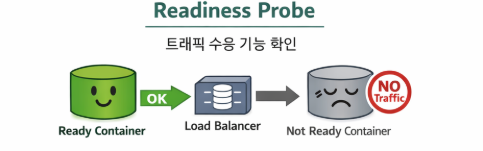
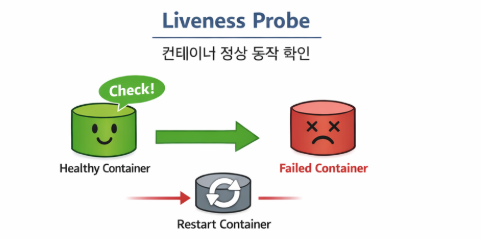

# Kubernetes Probe 설정으로 안정적인 Rollout 구성하기

배포 시점의 간헐적인 서비스 오류를 줄이기 위해 Probe를 어떻게 설정할지 정리해보았습니다.

---

## 1) 개요

FO 서비스에서 **배포(pod rollout) 시 간헐적 오류**가 발생하는 이슈가 있었습니다.

추정 원인은 다음과 같았습니다.

- Pod는 생성되었지만 애플리케이션이 아직 완전히 기동되지 않은 상태였음
- 하지만 ALB, Istio Gateway, Service 단에서 이를 완전히 구분하지 못하고 트래픽을 전달했음
- 그 결과, **준비되지 않은 Pod가 실제 요청을 받으면서 순간적인 오류가 발생**했음

이런 상황을 줄이기 위해, rollout 과정에서 **Startup Probe / Readiness Probe / Liveness Probe**를 명확히 설정하여
**안정적인 배포 환경**을 구성하는 것을 목표로 진행했습니다.

Kubernetes의 Probe는 컨테이너 상태를 주기적으로 확인하여,
서비스 안정성과 자동 복구(Self-healing)를 보장하는 기능입니다.

---

## 2) 왜 Probe가 필요한가?

Kubernetes에서 Pod가 `Running` 상태라고 해서,
곧바로 **트래픽을 받아도 되는 상태**라는 뜻은 아닙니다.

실제로는 아래와 같은 시간이 필요할 수 있습니다.

- 애플리케이션 기동 시간
- DB 연결 초기화 시간
- 캐시 적재 시간
- 외부 연동 모듈 초기화 시간

즉, **프로세스는 떠 있지만 서비스는 아직 준비되지 않은 상태**가 충분히 발생할 수 있습니다.

이때 Probe를 사용하면 다음과 같은 제어가 가능합니다.

1. **Startup Probe**: 애플리케이션이 처음 정상 기동했는지 확인
2. **Readiness Probe**: 지금 트래픽을 받아도 되는 상태인지 확인
3. **Liveness Probe**: 실행 중인 애플리케이션이 살아있는지 확인

이 3가지를 분리하면 rollout 중에도 훨씬 안정적으로 트래픽을 제어할 수 있습니다.

---

## 3) Startup Probe 세팅

### 개념

`startupProbe`는 **애플리케이션의 초기 기동 완료 여부**를 확인합니다.

특히 Spring Boot처럼 초기 구동 시간이 길 수 있는 애플리케이션에서는,
기동 중인 상태를 장애로 오인하지 않도록 `startupProbe`를 두는 것이 꽤 중요합니다.

기본적으로는 아래와 같은 health check 경로로 확인할 수 있습니다.

- 예: `/api/bo/management/health`

### 진행 과정

- **성공 시**
    - 파드 실행
    - 60초 대기
    - `startupProbe` 확인
    - 성공하면 이후 `readinessProbe` / `livenessProbe` 단계로 진행

- **실패 시**
    - 파드 실행
    - 60초 대기
    - `startupProbe` 확인
    - 실패하면 60초 대기 후 재확인
    - 이 과정을 반복

즉, 애플리케이션이 완전히 뜰 때까지는 **아직 서비스 준비가 끝나지 않았다**고 판단하게 됩니다.


---

## 4) Readiness Probe 세팅

### 개념

`readinessProbe`는 **현재 Pod가 트래픽을 받아도 되는 상태인지**를 확인합니다.

이 Probe가 성공해야만 해당 Pod가 Service의 엔드포인트에 포함되고,
실제 요청을 받을 수 있게 됩니다.

확인 경로는 보통 아래와 같습니다.

- 예: `/api/bo/management/health/readiness`
- 별도 readiness endpoint가 없다면 기본 health 경로 사용

### 진행 과정

- **성공 시**
    - 60초 대기
    - `readinessProbe` 진행
    - 성공하면 해당 파드로 트래픽 전송 시작
    - 이후 `livenessProbe`는 지속적으로 실행

- **실패 시**
    - 60초 대기
    - `readinessProbe` 진행
    - 실패하면 60초 대기 후 재확인
    - 성공 전까지는 트래픽을 받지 않음

이 설정이 핵심입니다.

**Pod가 떠 있는 것**과 **Pod가 요청을 처리할 준비가 된 것**은 다르기 때문에,
rollout 중에는 특히 `readinessProbe`가 제대로 걸려 있어야
준비되지 않은 Pod로 트래픽이 들어가는 상황을 줄일 수 있습니다.



---

## 5) Liveness Probe 세팅

### 개념

`livenessProbe`는 **실행 중인 애플리케이션이 정상적으로 살아있는지**를 확인합니다.

애플리케이션이 응답 불가 상태에 빠졌는데 프로세스만 살아있는 경우,
Kubernetes는 이를 자동으로 재시작하여 복구를 시도할 수 있습니다.

확인 경로는 보통 아래와 같습니다.

- 예: `/api/bo/management/health/liveness`
- 별도 liveness endpoint가 없다면 기본 health 경로 사용

### 진행 과정

- **성공 시**
    - 파드 실행 중 주기적으로 `livenessProbe` 체크
    - 성공하면 다음 주기까지 대기

- **실패 시**
    - 파드 실행 중 `livenessProbe` 체크 실패
    - Kubernetes가 해당 파드를 재시작
    - 재실행 후에는 다시 `startup → readiness → liveness` 순서로 진행

즉, `livenessProbe`는 **장애가 난 애플리케이션을 사람이 직접 조치하지 않아도 자동 복구**할 수 있게 도와줍니다.



---

## 6) 예시 설정

아래는 위 내용을 기준으로 정리한 예시입니다.

```yaml
apiVersion: apps/v1
kind: Deployment
metadata:
  name: sample-app
spec:
  replicas: 2
  selector:
    matchLabels:
      app: sample-app
  template:
    metadata:
      labels:
        app: sample-app
    spec:
      containers:
        - name: sample-app
          image: sample-app:latest
          ports:
            - containerPort: 8080

          startupProbe:
            httpGet:
              path: /api/bo/management/health
              port: 8080
            initialDelaySeconds: 60
            periodSeconds: 60
            timeoutSeconds: 5
            failureThreshold: 10

          readinessProbe:
            httpGet:
              path: /api/bo/management/health/readiness
              port: 8080
            initialDelaySeconds: 60
            periodSeconds: 60
            timeoutSeconds: 5
            failureThreshold: 3

          livenessProbe:
            httpGet:
              path: /api/bo/management/health/liveness
              port: 8080
            initialDelaySeconds: 120
            periodSeconds: 120
            timeoutSeconds: 5
            failureThreshold: 3
```

위 설정은 하나의 예시이며,
실제 운영환경에서는 애플리케이션 기동 시간과 헬스 체크 응답 특성에 맞춰 조정해야 합니다.

예를 들어,

- 기동이 느린 서비스라면 `startupProbe.failureThreshold`를 더 여유 있게
- 빠르게 준비되는 서비스라면 `readinessProbe.periodSeconds`를 더 짧게
- 장애 감지를 빠르게 해야 한다면 `livenessProbe.periodSeconds`를 더 짧게

조정하는 식으로 적용하면 됩니다.

---

## 7) 정리

이번 설정의 핵심은 아래와 같습니다.

1. **Startup Probe**로 초기 기동이 끝났는지 확인
2. **Readiness Probe**로 준비된 Pod에만 트래픽 전달
3. **Liveness Probe**로 비정상 상태의 Pod 자동 재시작

결국 Probe 설정의 목적은,
**"Pod가 떠 있느냐"가 아니라 "정상적으로 서비스를 처리할 수 있느냐"를 기준으로 배포를 안정화하는 것**입니다.

rollout 중 간헐적인 오류가 발생한다면,
애플리케이션 로직만 보기보다 **Probe 설정과 트래픽 유입 시점**을 먼저 점검해보는 것이 꽤 중요합니다.

운영 환경에서는 작은 설정 차이 하나가 배포 안정성을 크게 바꾸기 때문에,
이런 부분은 미리 정리해두면 이후 장애 대응에도 확실히 도움이 됩니다.
