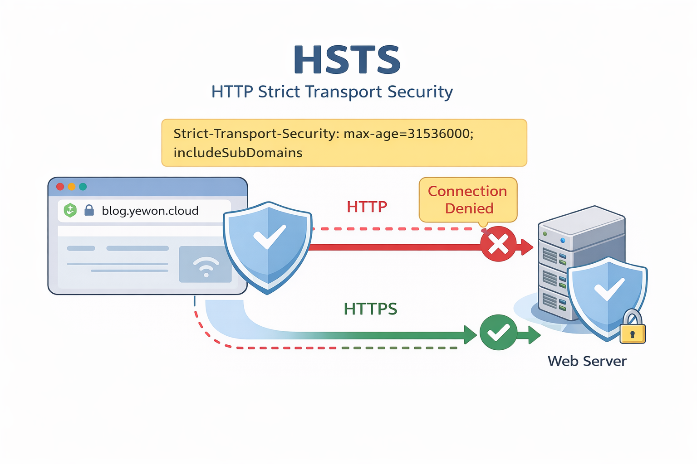

# Istio 환경에서 HSTS 미적용 문제 해결 과정

MSA 구조에서 서비스별로 HTTPS는 정상적으로 적용되어 있었지만,
보안 점검 과정에서 HSTS가 일부 API 응답에 적용되지 않는 문제를 확인했습니다.
이 글에서는 해당 문제를 분석하고, Istio 환경에서 HSTS를 통일 적용한 과정을 정리합니다.

---

## HSTS가 뭘까?

HSTS(HTTP Strict Transport Security)는 브라우저에게
"이 도메인은 앞으로 HTTPS로만 접속하라"고 알리는 보안 정책입니다.



서버가 아래 헤더를 응답에 포함하면,
브라우저는 지정된 기간 동안 HTTP 접속을 HTTPS로 강제합니다.

```text
Strict-Transport-Security: max-age=31536000; includeSubDomains
```

핵심 포인트:

- HSTS는 **브라우저 동작을 바꾸는 정책**
- **HTTPS 응답에서만** 유효
- 내부 서비스 간 통신 정책이 아니라, 최종 사용자 브라우저 접속 정책

---

## 문제/상황

서비스 구조는 다음과 같았습니다.

- MSA 구조 (FO / GW / API)
- Istio Gateway를 통해 외부 트래픽 유입
- 각 서비스는 도메인 기반으로 통신

보안 점검 결과:

- `https://blog.yewon.cloud` → HSTS 정상 적용
- `https://blog.yewon.cloud/api` → HSTS 미적용

즉, 동일 도메인인데도 일부 경로에서 HSTS가 빠지는 문제가 있었습니다.

---

## 해결 방법 / 개요

문제를 해결하기 위해 다음을 확인했습니다.

- HSTS 적용 위치 확인 (앱 vs 인프라)
- 요청 흐름 분석
- Istio VirtualService에서 응답 헤더 적용

---

## 아키텍처 / 흐름

현재 구조는 아래와 같았습니다.

```text
브라우저
  ↓
Istio Gateway
  ↓
FO (Node.js)
  ↓
GW (Spring Boot)
  ↓
API 응답
```

여기서 중요한 점:

- FO 요청은 FO 서버가 응답 생성
- API 요청은 GW가 응답 생성

응답 주체가 다르면, 애플리케이션 레벨 헤더 설정 결과도 달라질 수 있습니다.

---

## 사전 준비

- Kubernetes + Istio 환경
- VirtualService 기반 라우팅 구성
- HTTPS 적용 완료 상태

---

## 1. 문제 원인 분석

처음에는 FO에서 HSTS가 정상 적용되고 있었기 때문에,
전체 서비스에 문제가 없다고 판단했습니다.

하지만 API 요청을 확인해보면:

```bash
curl -I https://blog.yewon.cloud/api
```

응답에 `Strict-Transport-Security` 헤더가 없었습니다.

### 1-1) 원인

- FO는 Node.js 애플리케이션에서 HSTS 설정
- GW는 별도 HSTS 설정 없음
- Istio에서는 기본적으로 HSTS를 자동 추가하지 않음

결과적으로:

- FO 응답 → HSTS 있음
- API 응답 → HSTS 없음

---

## 2. 해결 사고 과정

처음에는 GW 애플리케이션에 HSTS를 추가하는 방안을 먼저 고려했습니다.

하지만 구조를 보면 최종 응답은 항상 Istio를 거쳐 브라우저로 전달됩니다.

```text
브라우저 → Istio → 서비스 → Istio → 브라우저
```

따라서 서비스별로 제각각 적용하기보다,
**Istio 레벨에서 공통 정책으로 관리**하는 편이 운영상 더 일관적이라고 판단했습니다.

---

## 3. 해결 방법

Istio VirtualService의 응답 헤더에 HSTS를 추가해 해결했습니다.

```yaml
http:
  - name: "blog-gw-http"
    headers:
      response:
        add:
          Strict-Transport-Security: "max-age=31536000; includeSubDomains"
    route:
      - destination:
          host: blog-gw-svc
          subset: v1
```

### 3-1) 적용 위치

중요한 점:

- `spec.http[].headers.response` 위치에 추가해야 함
- `spec` 바로 아래에 넣으면 적용되지 않음

### 3-2) Istio 헤더 조작 옵션

`headers.response`에서 자주 쓰는 옵션:

- `add`: 기존 값에 헤더 추가
- `set`: 해당 헤더 값을 덮어쓰기
- `remove`: 특정 헤더 제거

상황에 따라 `add` 대신 `set`이 더 안전할 수 있습니다.

---

## 4. 적용 중 발생한 문제

템플릿 수정 후에도 HSTS가 적용되지 않는 문제가 있었습니다.

확인 결과:

- Node.js 템플릿만 수정
- GW(Spring Boot) 템플릿은 수정하지 않음

즉, 서로 다른 Helm chart를 사용하고 있었고,
수정한 템플릿이 실제 GW 서비스에는 반영되지 않았습니다.

---

## 5. 최종 구조

최종적으로는 아래처럼 정리했습니다.

- FO: 애플리케이션 HSTS 제거 (선택)
- GW: Istio VirtualService에서 HSTS 적용
- 이후 공통 템플릿으로 전체 서비스에 확장 가능

---

## 6. HSTS 옵션 정리

HSTS 헤더에서 실무적으로 확인할 항목은 아래 3가지입니다.

```text
Strict-Transport-Security: max-age=31536000; includeSubDomains; preload
```

- `max-age=<seconds>`
  - HTTPS 강제 기간 (초)
  - 예: `31536000` = 1년
  - 해제 시 `max-age=0`

- `includeSubDomains`
  - 하위 도메인까지 HTTPS 강제

- `preload`
  - 브라우저 preload 목록 등록을 위한 선언
  - 실제 preload 반영은 별도 등록 절차 필요

주의사항:

- HSTS는 첫 HTTPS 응답을 받은 뒤부터 동작
- `includeSubDomains`, `preload`는 영향 범위가 커서 도메인 운영 정책 검토 후 적용 권장

---

## 참고

- Istio VirtualService 문서 (Header Operations)
- MDN: Strict-Transport-Security
- OWASP HSTS 정책 가이드
