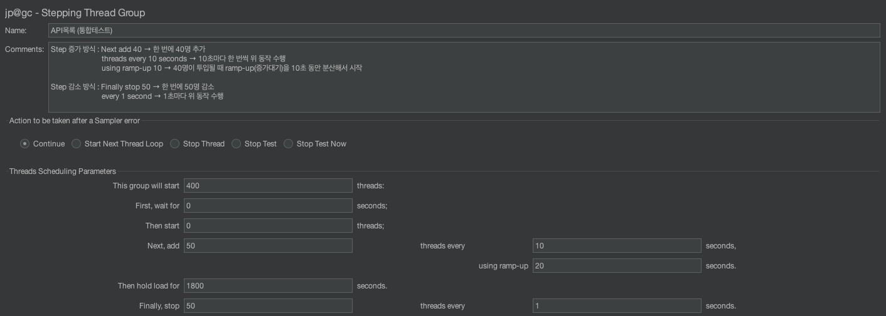
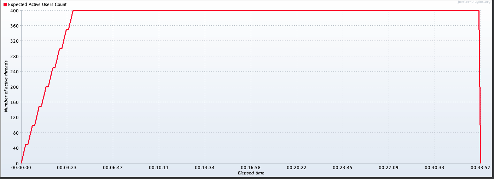
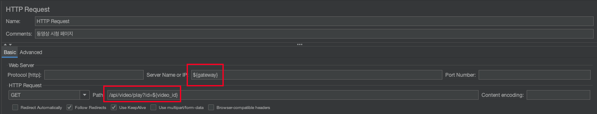
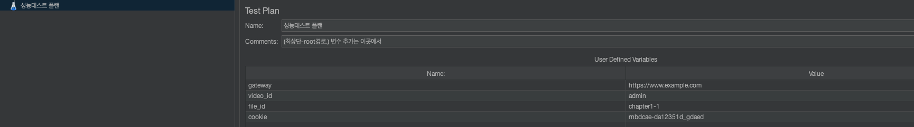
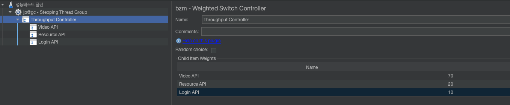

# JMeter를 활용한 부하테스트 시나리오 설계해보기

인터넷 강의 서비스를 예시로 JMeter 부하테스트 시나리오를 어떻게 설계할 수 있는지 정리해보았습니다.

---

## 1. 개요

이번 포스팅에서는 인터넷 강의 웹사이트를 대상으로,
JMeter를 활용한 부하(Load) 테스트 시나리오 설계 및 실행 예시를 소개합니다.

단순히 서버를 “죽이기” 위한 목적이 아니라,
서비스가 실제 피크 상황에서 얼마나 안정적으로 동작하는지를 검증하는 것이 목표입니다.

---

## 2. 테스트 시나리오 개요

### 2-1. 가정된 서비스 상황

- 서비스: 인터넷 강의 사이트
- 주요 기능
  - 로그인
  - 동영상 시청 (Streaming API)
  - 학습자료 다운로드 (File Download API)

### 2-2. 테스트 목적

- 피크 타임에 예상되는 최대 동시 사용자 부하 재현
- 주요 API의 응답 시간, 처리량(TPS), 에러율 분석
- 서버 병목 지점 및 스케일링 필요 여부 확인

---

## 3. 부하 조건 정의

| 항목 | 설정값 |
| --- | --- |
| 총 사용자 수 | 400명 |
| 테스트 지속 시간 | 30분 |
| 부하 증가 방식 | 점진적 증가 (Stepping Thread Group) |
| Ramp-up 단계 | 50명씩 10초 간격으로 증가 |
| 유지 시간 | 30분 |
| 주요 API 비율 | 동영상 70% / 학습자료 20% / 로그인 10% |



---

## 4. JMeter 시나리오 설계

### 4-1. Thread Group 구성

JMeter의 `Stepping Thread Group` 플러그인을 사용하면,
테스트 사용자를 일정 비율로 점진적으로 증가시키는 시뮬레이션이 가능합니다.

설정 예시는 아래와 같습니다.

```text
Initial Users: 50
Add 50 users every 10 seconds
Hold load for: 1800 seconds
Total Users: 400
```



즉,
사용자를 한 번에 400명 넣는 것이 아니라,
50명씩 일정 간격으로 올리면서 실제 피크 유입과 유사한 형태를 만들어볼 수 있습니다.

### 4-2. HTTP Request 구성

| 샘플러 이름 | API 엔드포인트 | 비율 | 설명 |
| --- | --- | --- | --- |
| 동영상 시청 | `/api/video/play?id=${video_id}` | 70% | 가장 빈도가 높은 API |
| 학습자료 다운로드 | `/api/resource/download?id=${file_id}` | 20% | 대용량 파일 응답시간 검증 |
| 로그인 | `/api/auth/login` | 10% | 세션 생성 및 인증 API |



JMeter에서는 `${}` 문법을 통해 변수 처리도 가능합니다.

예를 들어 `${video_id}`, `${file_id}`처럼 사용하면,
동적으로 다른 파라미터 값을 넣어 테스트할 수 있습니다.

변수 설정은 GUI 상단의 플라스크 모양 메뉴 등을 통해 전역 변수 형태로 관리할 수 있습니다.



### 4-3. Weighted Controller 구성

다양한 API 호출 비율을 조정하기 위해 `Throughput Controller`를 사용하여 아래와 같이 설정합니다.

| Controller | Throughput (%) |
| --- | --- |
| Video API | 70 |
| Resource API | 20 |
| Login API | 10 |

각 Controller 안에는 대응되는 HTTP Sampler를 배치하여,
비율에 맞는 트래픽을 자동으로 분배합니다.



이런 식으로 가중치를 조절하면,
실제 사용자 패턴과 조금 더 유사한 테스트를 설계할 수 있습니다.

---

## 5. JMeter 시나리오 트리 구조 예시

아래와 같은 구조로 테스트 플랜을 구성할 수 있습니다.

```text
Test Plan
├── Thread Group (Stepping Thread Group)
├── CSV Data Set Config (사용자 ID 목록)
├── Throughput Controller (70%) - [동영상 시청 API]
│   └── HTTP Request: /api/video/play
├── Throughput Controller (20%) - [학습자료 다운로드 API]
│   └── HTTP Request: /api/resource/download
├── Throughput Controller (10%) - [로그인 API]
│   └── HTTP Request: /api/auth/login
└── View Results Tree (테스트 중 비활성)
    ├── Summary Report
    └── Backend Listener (InfluxDB / Grafana 연동 시)
```

---

## 6. 실행 및 모니터링

### 6-1. CLI 모드 실행

```bash
jmeter -n \
  -t scenario/internet_course_test.jmx \
  -l results/test_result.jtl \
  -e -o results/report
```

### 6-2. 실시간 모니터링 도구

- Grafana + InfluxDB
  - TPS, 응답시간, 에러율 시각화
- JMeter Dashboard Report
  - `/results/report/index.html`

GUI로만 테스트하면 부하가 커질수록 클라이언트 자원도 같이 많이 쓰기 때문에,
실제 실행은 CLI 모드로 돌리는 편이 일반적으로 더 적절합니다.

---

## 7. 분석 포인트

목표 설정 예시는 아래와 같이 둘 수 있습니다.

| 지표 | 목표 기준 | 해석 포인트 |
| --- | --- | --- |
| 평균 응답시간 | 1초 이하 | 2초 이상이면 병목 가능성 |
| 에러율 | 1% 이하 | API 예외 처리 / DB timeout 의심 |
| TPS | 일정하게 유지 | 급감 시 서버 과부하 가능성 |
| CPU / Memory | 80% 이하 | 지속 과부하 시 스케일링 고려 |

---

## 8. 테스트 결과 예시 (가정)

| 구간 | 사용자 수 | 평균 응답시간 | TPS | 에러율 |
| --- | --- | --- | --- | --- |
| 초기 (50명) | 0~3분 | 0.4s | 85 | 0% |
| 중간 (200명) | 3~12분 | 0.8s | 170 | 0.3% |
| 피크 (400명) | 12~30분 | 1.5s | 220 | 1.2% |

결론적으로,
피크 시점에서도 요청 처리량은 유지되지만
동영상 API 응답시간이 1.5초까지 상승했다면,
CDN 캐싱 정책이나 스트리밍 경로 최적화 등을 검토해볼 수 있습니다.

---

## 9. 정리

| 항목 | 내용 |
| --- | --- |
| 테스트 목적 | 피크 부하 상황에서 서비스 안정성 검증 |
| 도구 | Apache JMeter |
| 주요 기능 | 로그인, 동영상 재생, 학습자료 다운로드 |
| 테스트 방식 | Stepping Thread Group + Throughput Controller |
| 결과 요약 | TPS는 안정적이나 응답속도 개선 여지 있음 |

단순한 성능 테스트를 넘어,
실제 사용 패턴을 반영한 시나리오 기반 부하 테스트 설계를 진행해볼 수 있습니다.

즉,
서버가 죽는 것을 방지하는 데서 끝나는 것이 아니라,
성능 개선 포인트나 에러 발생 구간을 찾는 데에도 꽤 유용하게 활용할 수 있습니다.

---

## 10. 참고 링크

자세한 예시는 아래 저장소를 참고하시면 됩니다.

- [overload_test GitHub 저장소](https://github.com/yewon4540/overload_test?tab=readme-ov-file#%EA%B0%9C%EB%85%90)